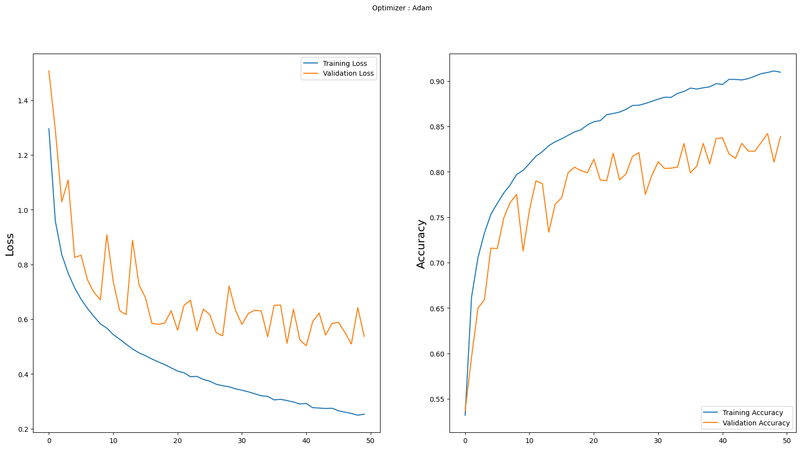
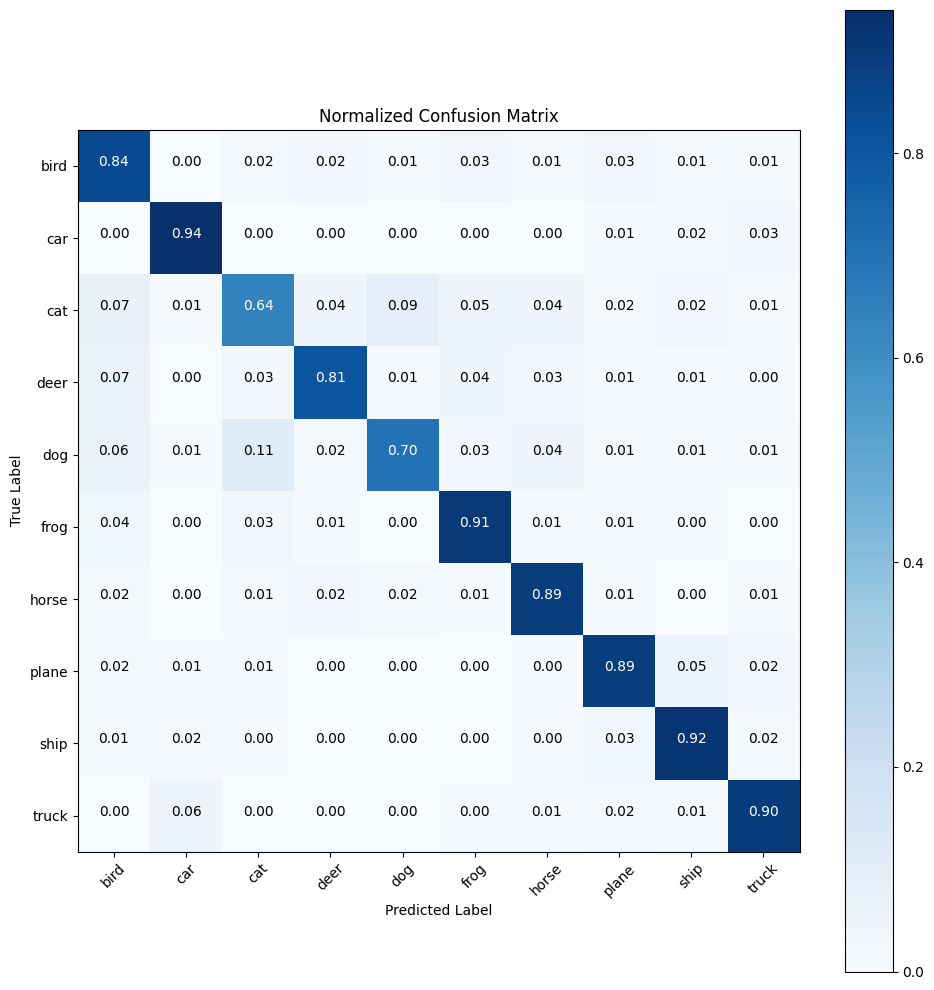

# CIFAR-10 CNN CLASSIFIER

## A simple CNN for predicting classes of images using the [CIFAR-10](http://www.cs.toronto.edu/~kriz/cifar.html) dataset.

##### You can read about the dataset in the link provided. It predicts 10 classes of objects. 

##### I have written a script under **cifar.py** which will take the dataset and sort it into folders based on their class. You can just load it directly from the files provided in the dataset, but I like doing it this way.

##### It uses 8 convolution layers, and for each convolution we call batch normalization/activation to mitigate overfitting. The output layer takes advantage of global average pooling (GAP), which eliminates the need for fully connected layers (and in my experience, worked much more effectively).

## Results

##### The model was run for 50 epochs. Find the loss and accuracy plots below:

##### The best model gave a validation accuracy of 84.2%, with a validation loss of 0.5092. The train accuracy was 90.9%, with a train loss of 0.2555.

##### The confusion matrix for the validation data can be found below: 

##### Ideally, I would've created a separate test set, but this was really just a quick exercise. The model seems to perform well for most classes, but has some issues distinguishing cats, dogs, and deer (at least relative to the other classes). A different model structure could perhaps fix this issue (maybe using some dropout layers, for example), or perhaps resizing the images to a larger size. 

##### There is a resize() function at the start of the code which uses OpenCV to interpolate pixels and expand/shrink the images as you wish, but I just left as they were for now. Perhaps increasing their size to 64x64 will yield better results. This would significantly increase training time, but this could be remedied by loading the images as grayscale instead of RGB. 